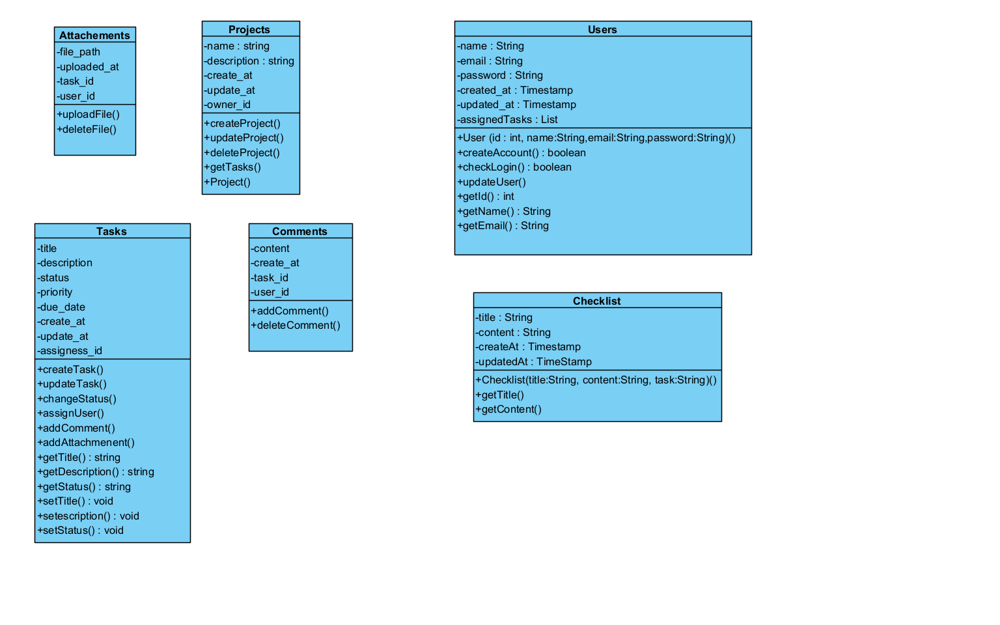

# ỨNG DỤNG QUẢN LÝ TIẾN ĐỘ CÔNG VIỆC

##  Giới thiệu dự án
Ứng dụng quản lý công việc đội nhóm là một ứng dụng Java được xây dựng nhằm mục đích theo dõi, cập nhật tiến độ công việc trong một dự án cá nhân hay đội nhóm.

##  Mục tiêu dự án
- Ứng dụng nhằm mục đích áp dụng các khái niệm về lập trình hướng đối tượng (OOP), mô hình MVC.
- Vận dụng kiến thức về cơ sở dữ liệu trong việc quản lý dữ liệu người dùng, dự án, công việc, nhóm làm việc và phân quyền.
- Mang lại sản phẩm có tính ứng dụng thực tiễn, dễ mở rộng và phát triển thêm các chức năng nâng cao.

##  Phạm vi và Đối tượng sử dụng
**Phạm vi**: Dự án tập trung vào quản lý các đầu việc trong một dự án cụ thể.

**Đối tượng sử dụng**:
- **Người dùng cá nhân**: Có nhu cầu đặt ra mục tiêu các task nhằm theo dõi tiến độ của dự án.
- **Các đội nhóm vừa và nhỏ**: Quản lý thành viên và công việc trong nhóm hiệu quả.

---

##  Các tính năng chính

###  Quản lý công việc (Task Management)
- **Kanban Board**: Quản lý công việc trực quan với giao diện bảng Kanban.
- **Calendar View**: Xem lịch làm việc và hạn chót.
- **Danh sách công việc**: CRUD nhiệm vụ, checklist, labels, comments.

###  Quản lý Dự án & Nhóm
- **Dự án**: Quản lý thông tin dự án, tiến độ.
- **Nhóm**: Quản lý thành viên, phân quyền (Roles & Permissions).

###  Người dùng
- Đăng ký, đăng nhập, quản lý profile.

---

##  Công nghệ sử dụng
- **Ngôn ngữ**: Java (JDK 8+)
- **Cơ sở dữ liệu**: MySQL
- **Công cụ phát triển**: IntelliJ IDEA, VS Code, MySQL Workbench
- **Quản lý phiên bản**: GitHub
- **Giao diện**: Java Swing
- **Kiến trúc**: Model-View-Controller (MVC)

---

##  Cài đặt và Sử dụng

### 1. Sao chép dự án (Clone Repository)
Mở terminal hoặc command prompt và chạy lệnh sau để tải dự án về máy:
```bash
git clone https://github.com/nbatho/OOP_Project.git
cd OOP_Project
```

### 2. Cài đặt môi trường (JDK Setup)
- Đảm bảo máy tính đã cài đặt **JDK 21**.
- Kiểm tra phiên bản Java bằng lệnh:
  ```bash
  java -version
  ```

### 3. Thêm thư viện (Add Libraries)
Dự án sử dụng các thư viện ngoài nằm trong thư mục `lib`. Bạn cần thêm chúng vào **Project Structure / Libraries** trong IDE của mình:
- `lib/jcalendar-1.4.jar` (Hỗ trợ lịch)
- `lib/mysql-connector-j-9.5.0.jar` (Kết nối MySQL)

### 4. Thiết lập Cơ sở dữ liệu
1. Tạo database: `CREATE DATABASE task_manager_db;`
2. Chạy ứng dụng lần đầu để tự động tạo bảng.
3. (Tùy chọn) Chạy `docs/dataSechema.sql` để thêm dữ liệu mẫu.

### 5. Cấu hình
Cập nhật `src/main/java/config/DatabaseConnection.java` với thông tin MySQL của bạn.

### 6. Chạy ứng dụng
Chạy file `src/Main.java`.

---

##  Cấu trúc dự án
Dự án được tổ chức theo mô hình MVC, phân chia rõ ràng giữa các tầng:

```
src
└── main
    └── java
        ├── config          # Cấu hình hệ thống (DatabaseConnection)
        ├── controller      # Xử lý logic, điều hướng (LoginController, DashboardController...)
        ├── model           # Các lớp thực thể (User, Task, Project...)
        ├── repository      # Tương tác cơ sở dữ liệu (DAO)
        ├── service         # Xử lý nghiệp vụ (AuthService, TaskService...)
        ├── view            # Giao diện người dùng (DashboardView, KanbanView...)
        ├── component       # Các thành phần UI tái sử dụng
        └── Utility         # Các tiện ích hỗ trợ
```

<div align="center">

</div>

---

## 📄 Báo cáo & Tài liệu
- **Link nộp báo cáo**: [Điền link báo cáo tại đây](https://docs.google.com/document/d/1wYD9f5Ori1-Zo6Jsndia_HcDmGf3vs-4NzfKXtR7XSg/edit?tab=t.0)]
